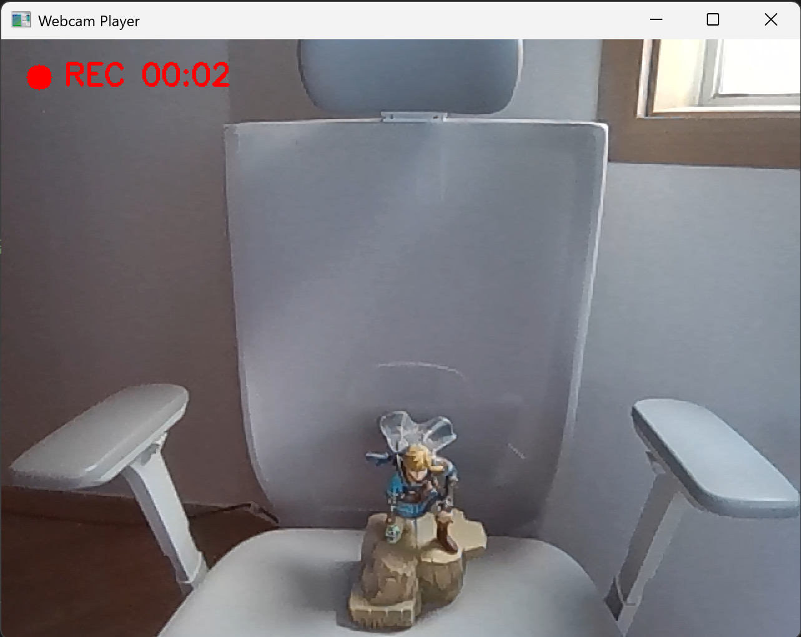

# my-webcam-recorder

This is a simple Python program made with OpenCV. It shows webcam video in real time, lets the user apply a few effects, and can record video.

## Example Image

## Features

- Show webcam video
- Turn black and white mode on and off
- Turn negative mode on and off
- Turn mirror mode on and off
- Record video as an AVI file
- Show `REC` and recording time on the screen

## Project Files

- `WebcamRecorder.py`: main Python file
- `example_image.png`: example image shown in the GitHub README

## Requirements

- Windows
- Python 3.x
- OpenCV (`cv2`)

## Installation

You only need to install OpenCV to run this project.

## Controls

- `Space`: start or stop recording
- `b`: toggle black-and-white mode
- `n`: toggle negative color mode
- `m`: toggle mirror mode
- `Esc`: exit the program

## Output File

- Recorded videos are saved in the project folder.
- File names are saved like `recorded video_0.avi`, `recorded video_1.avi`, and so on.
- The file format is `.avi`.

## Example Image

This project includes `example_image.png` as a sample image.

It is added to the README so the result can be seen directly on the GitHub page.

## Simple Explanation

The program uses the default webcam on the computer.

If you turn on black and white mode, negative mode, or mirror mode, the same effect is also applied to the recorded video.

